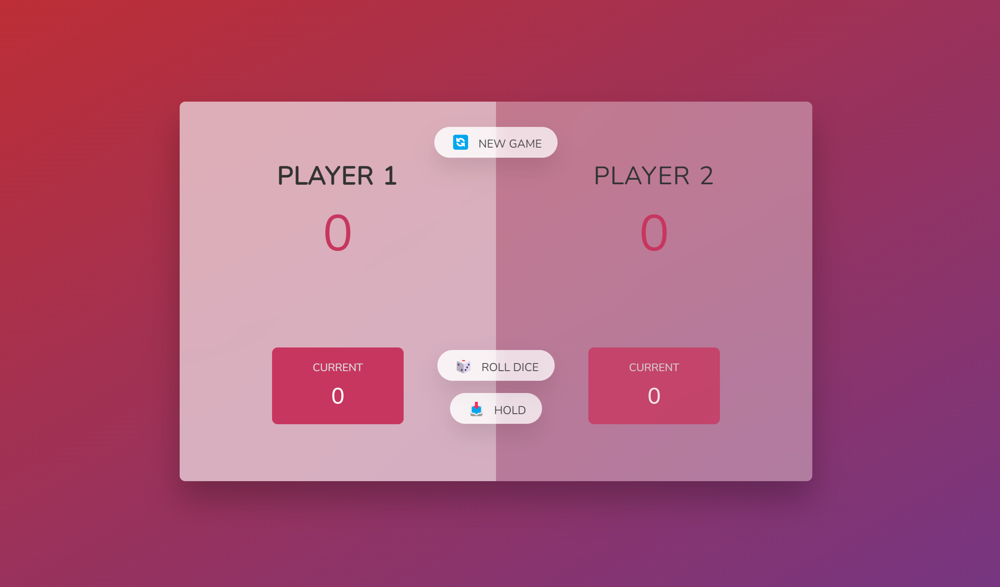

# Игра "Кости" на JavaScript

## Описание
Эта игра представляет собой классическую настольную игру в кости, разработанную для двух игроков. Интерфейс разделён на две части, каждая из которых представляет одного из участников. 
Игроки по очереди бросают кости и накапливают очки, которые могут быть сохранены или утеряны, в зависимости от исхода каждого броска.

## Особенности
- **Двухпользовательская игра:** Интерфейс позволяет двум игрокам участвовать в игре по очереди.
- **Управление игрой:** Игроки могут начать новую игру, бросить кости или сохранить свои очки с помощью кнопок на интерфейсе.
- **Счётчик очков:** Текущее количество очков каждого игрока отображается на экране.
- **Общий счёт:** На экране также показан общий счёт каждого из игроков.

## Технологии
- **HTML:** Создание структуры элементов интерфейса.
- **CSS:** Стилизация интерфейса и создание визуальных эффектов.
- **JavaScript:** Логика игры, обработка броска костей и подсчёт очков.

## Запуск проекта
Чтобы запустить это приложение локально с помощью Live Server:

1. Установите [Visual Studio Code](https://code.visualstudio.com/), если вы этого ещё не сделали.
2. Установите расширение [Live Server](https://marketplace.visualstudio.com/items?itemName=ritwickdey.LiveServer).
3. Клонируйте репозиторий приложения на свой локальный компьютер.
4. Откройте папку проекта в Visual Studio Code.
5. Перейдите в файл `index.html`.
6. Нажмите правой кнопкой мыши на файл и выберите `Open with Live Server`, или воспользуйтесь комбинацией клавиш `Alt+L Alt+O`.
7. Ваш браузер автоматически откроет приложение по адресу `http://127.0.0.1:5500/` или другому порту, если 5500 уже используется.

